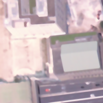
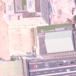
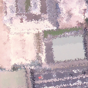
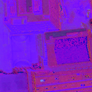
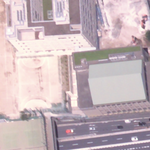
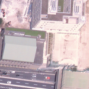
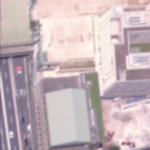
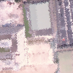
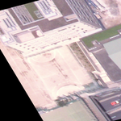
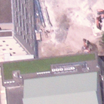

# Satellite Image Segmentation Using PyTorch # 

This repo contains a U-Net implementation for satellite segmentation 


## Data preparation ##

Due to a severe lack of training data, several pre-processing steps are taken to try and 
alleviate this. First, the annotations are converted from their json files to image masks. Then, the satellite images are further tiled
down, to tiles of size `(512x412)`, so that the images can be fed into a fully convolutional network (**FCN**) for semantic segmentation.
The augmentations are: 
  - `blur`: combination of medial and bilateral blur
  - `bright increase`: increase brightness artificially
  - `distort`: elastic deformation of image
  - `gaussian blur`: gaussian blurring
  - `HSV`: convert channels to HSV
  - `medial blur`: median blur
  - `mirror`: mirror image
  - `rotation invariance`: apply rotation invariance (see `data_utils.augment.rotation_invariance()` for details)
  - `crop + resize`: crop image randomly and resize to size expected by network (crop is applied to both image and mask)

### sample of applied augmentations ###

blur |  bright increase  | distort  |  gaussian blur | 
:-------------------------:|:-------------------------:|:-------------------------:|:-------------------------:
 |    |   |   | 


| HSV shift  |  median blur  | mirror  |  gaussian blur + rotation
:-------------------------:|:-------------------------:|:-------------------------:|:-------------------------:
 |    |   |  

| distort + rot  |  rotation invariance  | crop + resize  
:-------------------------:|:-------------------------:|:-------------------------:
 |    |   


## Network & Training ##

[U-Net](https://arxiv.org/abs/1505.04597) is used as a base model for segmentation. The original intention was to use U-Net to show base results,
and then train **PSPNet** ([Pyramid Scene Parsing Network](https://arxiv.org/abs/1612.01105)) using a pretrained satellite segmentation model and show comparisons, but time did not allow for this. The PSP implementation 
is still added in this repo. 

### training parameters ###

U-Net was trained for 50 epochs, with a batch size of 4.

The base parameters for training can be seen, and adjusted, in `run_training.py`:


```python
def setup_run_arguments():
    args = EasyDict()
    args.epochs = 50
    args.batch = 4
    args.val_percent = 0.2
    args.n_classes = 4
    args.n_channels = 3
    args.num_workers = 8

    args.learning_rate = 0.001
    args.weight_decay = 1e-8
    args.momentum = 0.9
    args.save_cp = True
    args.loss = "CrossEntropy"
```

The trained model is provided in `checkpoints/unet-augment-final.pth`


## Generating json annotations from U-Net predictions ##

The expected output is a json annoted file containing the vector points corresponding to the classes. 
A function for generating such file is found in `predict.prediction_to_json(...)`. A python notebook
is provided showing how to generate the json file, as well as how to generate a color mask file for the json file. 